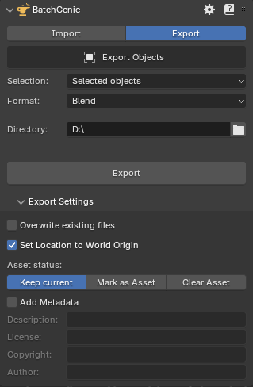

{ .img-box align=right }
# Exporting [BETA]

The exporting functionality, released in version **1.0.6**, is still under development, and the current functions are quite basic.

At present, you can only export objects as separate Blender files from your current blend file. In the near future, the export functionality will be expanded and will also be available in the Asset Browser for easy exporting of your assets in various formats.

To find the current exporting tools, navigate to the main `BatchGenie panel` in the 3D Viewport and click on  `export`.

### Settings

- **Selection**: Allows you to specify which objects to include in Export:
    - **Selected Objects**: Choose the currently selected object(s) in your scene.
    - **Objects marked as Assets**: Objects in the your file that are marked as Assets.
    - **Objects NOT marked as Assets**: Objects in the your file that are NOT marked as Assets.
    - **All Objects**: All objects in the your file regardless if they are marked as Assets or not.
- **Format**: Currently only **.Blend** files are supported.
- **Directory**: Choose a directory to export to. The exported files will be named after the object names.

- **Overwrite existing files**: Enable this to overwrite existing files with the same name in the selected folder.
- **Set Location to World Origin**: Sets the object's location to the world origin (0, 0, 0).
- **Asset status:**
    - **Keep current**: Keeps current Asset status.
    - **Mark as Asset**: Marks the Exported objects as Assets, making them easily accessible in Blender's Asset Browser for future use.
    - **Clear Asset**: Clears the Asset mark.
- **Add Metadata:**
    - **Description**
    - **License**
    - **Copyright**
    - **Author**