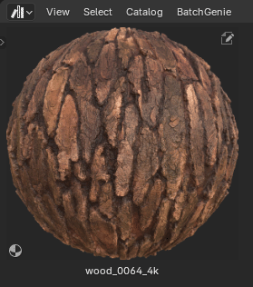

To access BatchGenie's Preferences, click on the :blender_icon_preferences:icon in the BatchGenie panel. Alternatively, you can go to  `Edit > Preferences `, find BatchGenie listed under the Add-ons tab, and click to access its settings for customization.

 

## Import { style="margin-top:0" }

{ .img-box align=left }

<h4 style="margin-bottom:-0.5em;">Texture Import</h4>

  - **Add Node Labels**: Adds labels such as 'Base Color', 'Roughness', etc., to imported texture nodes. If not enabled, the file names will be used as labels.

    ??? abstract "Label Example"
        A texture node with a label compared to one without:

        

  - **Minimize Nodes**: Minimizes texture-nodes in the node editor for a cleaner layout.

    ??? abstract "Minimize Example"
        The top texture node is minimized, while the bottom one remains expanded:

        

  - **Use Extended Formats**: Enables support for additional image file types when importing textures. By default, BatchGenie looks for `Png`, `Jpg`, `Jpeg`, `Tga`, `Webp`, `Exr`, `Tif`, `Tiff`, and `Bmp`. Enabling this setting expands the search to include `Sgi`, `Rgb`, `Bw`, `Jp2`, `J2c`, `Cin`, `Dpx`, and `Hdr`. This option is recommended only if you plan to import textures in these less common formats.
   This setting also applies to the [Load Previews from Disk](utilities.md#load-previews-from-disk) utility in the Asset Browser.
   For more information on supported formats, see the [Blender documentation](https://docs.blender.org/manual/en/latest/files/media/image_formats.html){ target="_blank" }.

  <h5>Material Name Settings</h5>

  - **Folder name as the material name**: If `enabled`, the name of the folder/subfolder will be used as the material name for textures found inside that folder. For the root folder: if only one texture set is found, the folder name will be used; if multiple texture sets are found, the folder name will not be used and the names will be derived from the texture filenames.
   If this option is `disabled`, the material name will be derived from the texture filenames
  - **Use Title Case**: Formats material names using Title Case, where each word starts with an uppercase letter and the remaining characters are lowercase (e.g., `example name` becomes `Example Name`).
  - **Split CamelCase names**: Splits names such as 'MetalBronzeWorn' into 'Metal Bronze Worn'.
  - **Remove Underscore & Dashes**: Replaces `_` and `-` in the material names with a space.
  - **Resolution Suffix**: Choose whether to add or remove texture resolution suffixes (e.g., 1K, 2K, 4K) from material names.
    - **Add**: Automatically appends the texture resolution to the material name, e.g., 'Oak Bark 4K', derived from the Base Color image. Skips adding the suffix if the material name already has one.
    > *Note: this function increases processing time during import since it needs to check the resolution of the images. Additional time per material: 0.2 ~ seconds.*
    - **Remove**: Removes resolution suffixes from material names if they are present. Supports both space-separated and underscore-separated suffixes (e.g., 'concrete_plaster_2k')
  - **Remove Fab.com ID**: Texture sets downloaded from Fab.com often include an ID in the name, such as `concrete_plaster_rfxxf0_2k`, where `rfxxf0` is the ID. Enabling this option removes the ID to simplify and declutter the name, resulting in `concrete_plaster_2k`. Note that this function depends on the JSON file that comes with the texture set being present and only works when you have one texture set per folder.

  - **Remove Keywords**: These keywords will be removed from the names of the imported materials. Enter one or more keywords separated by spaces. The process is case insensitive. There are two replacement modes with different behaviors:

      - **Loose Mode**: Uses regular expressions to match and remove keywords as standalone words. This mode removes keywords that appear as isolated words, considering word boundaries.

      - **Strict Mode**: Performs direct name replacement for each keyword. This mode removes the exact keyword from the name but does not alter any surrounding characters or delimiters.

        ??? abstract "Examples"
            Keyword `png`:

            - **Loose**:
                - For the name `Bark 4 png`, the function will remove 'png', resulting in `Bark 4`.
                - For the name `Bark_4_png`, no change will occur, as 'png' is part of a compound name with underscores, resulting in `Bark_4_png`.

            - **Strict**:
                - For the name `Bark 4 png`, the function will remove 'png', resulting in `Bark 4`.
                - For the name `Bark_4_png`, the function will remove 'png', resulting in `Bark_4_`. The underscores before 'png' will remain.

  <h5>Asset Tags</h5>

  - **Add resolution Suffix as Asset tag**: Similar to the above, but instead of modifying the material name, it applies the resolution as a tag to the Asset. This works only if 'Mark as Asset' is enabled.
  > *Note: this function increases processing time during import since it needs to check the resolution of the images. Additional time per material: 0.2 ~ seconds.*
  - **Import Fab.com Tags**: If the texture-set is downloaded from Fab.com, it typically comes with a JSON file containing metadata such as tags and the texture-set ID. Enabling this option imports this metadata and adds the ID and Tags as asset tags to the material. Note that this option does **NOT** fetch metadata from the internet. Additionally, this only works when there is one texture-set per folder, and requires that the `Mark as Asset` option is enabled.

  <h5>Texture Detection</h5>

  - **Texture Detection**: Edit the tags used for detecting different texture types during import. These tags, which are case-insensitive and separated by spaces, help BatchGenie automatically recognize and categorize textures.

    { .img-box align=left }

    - **DirectX Detection**: Specify keywords to automatically detect DirectX normal maps. If a DirectX normal map is found, a converter node is added to transform it to OpenGL format, which Blender uses. Enter one or more case-insensitive keywords separated by spaces.

    ??? abstract "Normal Map Conversion Example"
        

  <h5>Asset Previews</h5>

  - **Use Existing Preview**: Use existing preview images if available, providing a faster alternative to generating new previews. Search for images containing the word 'preview' in the texture set's folder to use as the material's Asset Preview (requires 'Mark as Asset' to be enabled). This allows using existing previews if available, providing a faster alternative to generating new ones. If 'Generation during import' is also enabled, existing previews take priority over newly generated ones. This works best when each texture set is stored in its own folder.

    ??? abstract "Example of 'Use Existing Preview'"
        A texture set with a preview image included and how it looks inside the Asset browser once imported.
        { .img-box .on-glb width=40% data-description="A texture set with a preview image included" style="margin-right:1em"}
        { .img-box .on-glb width=17% data-description="Once imported it is set as the Asset Preview image inside Asset Browser"}

  - **Generation during Import**: Controls whether Asset Previews are automatically generated during the texture import process. Options include:
    - **Low Quality**: Uses Blender's default Asset generation function for fast, but lower-quality previews.
    - **High Quality**: Uses the add-on to create high-quality previews during import. See the `Render Asset Previews` tab in the add-on panel for settings.

    !!! warning "Note on automatic generation"
        Enabling this feature may significantly increase processing time and affect stability, especially with a large number of textures. It is recommended to keep this setting disabled.

---

## Render { style="margin-top:0" }

{ .img-box align=left }

- **Custom Render Presets**: Presets you've created will appear in this dropdown for removal. You can also open the folder containing the presets for backup.
- **Denoise**: When the Denoising option is enabled during rendering in the BatchGenie panel under  `Render Settings `, the following settings are applied. They reflect Blender's default options for denoising.

    !!! info2 "Which Denoiser should I choose?"
        While **OptiX** excels in performance on Nvidia GPUs, **OpenImageDenoise** stands out for its adaptability across various hardware setups and is often favored for delivering better results. For further details see [this section](https://docs.blender.org/manual/en/latest/render/cycles/render_settings/sampling.html#denoising){ target="_blank" } in the Blender manual.

---

## Misc { style="margin-top:0" }

{ .img-box align=left }

- **Add-on Location**: Choose whether the add-on appears in its own "BatchGenie" tab in the N-Panel or within the existing Tool Panel. This option can help save tab space if the N-Panel is too crowded and also applies to the BatchGenie tab in the Shader Editor.

<h4 style="margin-bottom:-0.5em;">Advanced</h4>

- **External Asset Processing Max Threads**: Controls the number of parallel processes used when handling external Assets via the Asset Browser utilities. Specifically, it determines how many Blender processes run in the background when adding tags or metadata to Assets located outside the current blend file. Adjust this setting based on your system's capabilities to achieve optimal performance when processing external Assets.  Note that '**Max Threads**' does not apply to rendering Assets. The rendering process itself is the primary bottleneck, rather than the integration of rendered images with Assets.

<h4 style="margin-bottom:-0.5em;">Troubleshooting</h4>

- **Light Setup Thumbnails**: Generate thumbnails for the built-in HDR images used as Light Setups. This option is useful if you've added HDRIs to Blender (as explained [here](render.md#faq)) but they are not yet visible and you want to avoid restarting Blender, as thumbnails are generated upon startup.
- **Debug To Console**: Outputs debug information to the console, useful for troubleshooting. To view the console, go to `Window > Toggle System Console` (Windows) or through the system console if you're using Linux (requires starting Blender from the console).

    !!! warning "Performance Note"
        This should only be enabled if you need to troubleshoot, as it may have a slight performance hit.

- **Log to File**: When enabled, all debug information and error messages are saved to a log file for easier troubleshooting and analysis. Useful for tracking issues.

