---
tags:
  - Troubleshoot
---

BatchGenie offers a range of utilities to efficiently manage materials and other Assets. All utilities generate detailed reports in the console, providing insights into the actions performed by each utility. You can view these reports by navigating to `Window > Toggle System Console`.

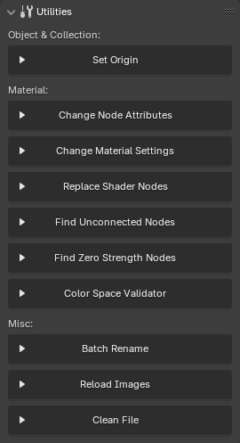{ .img-box align=right }

<h5>Where to find?</h5>

- Most utilities are located in the main BatchGenie panel in the `3D Viewport > BatchGenie N-Panel > Utilities`, focusing on batch operations, as shown in the image to the right.
- The `Asset Browser > BatchGenie Menu` contains Asset Tagging & Metadata utilities.
- The `Shader Editor > BatchGenie N-Panel` includes additional utilities for single operations on materials.

## Batch Utilities

### Change Node Attributes

> Location: 3D Viewport ▸ BatchGenie N-Panel ▸ Utilities

This utility enables you to batch modify attributes across multiple materials. It’s useful for making consistent adjustments to properties like roughness, metallic, or any other material attribute.

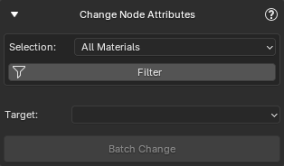{ .img-box align=left }

<h5>Settings</h5>

- **Only materials imported by BatchGenie**: When enabled, this option ensures that the batch operation only affect materials imported by BatchGenie. Disabling it applies changes to all materials in your file, regardless of their origin.
- **Selection**: Allows you to specify which materials to include in the batch run. Options listed below:
    - **All Materials**
    - **Materials on Selected Objects**
- **Target**: Specify which node inside the material to target. Refer to the options listed below for details.

=== "Shader Node"
    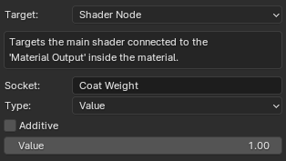{ .img-box align=left}
    Targets the main shader connected to the 'Material Output' inside the material. This can be any type of shader or a custom Node-Group.

    

    <h5>Settings</h5>

    - **Socket**: The name or number of the socket you want to update. Socket numbers start from the top at 0 (e.g., 0 for Base Color, 1 for Roughness, 2 for IOR, etc.). This field is case-sensitive.

    - **Type**:

        - **Color**: Set a specific color.
        - **Value**: Set a specific value.
        - **Random Integer**: Set a randomly generated number as the value.
        - **Random Float**: Set a randomly generated number with 5 decimals as the value. Example: 3.14159

        *For both Random Integer and Random Float, you can specify the range for the randomly generated values.*

    - **Additive**: When enabled, this option allows you to adjust the current value of by adding or subtracting your chosen value instead of replacing it. For example, if the 'Emission Strength' of a node is set to 1.0 and you enter a value of 5 with 'Additive' enabled, the new value will be 6. If you enter a value of -2, the new value will be -1.

=== "Texture Nodes"
    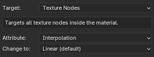{ align=left .img-box }
    Targets all texture nodes inside the material and you can adjust the following attributes:

      - **Interpolation**
      - **Projection**
      - **Extension**

    For further technical details about texture Interpolation, Projection & Extension see the [this section](https://docs.blender.org/manual/en/latest/render/shader_nodes/textures/image.html){ target="_blank" } in the Blender manual.

=== "Displacement Node"
    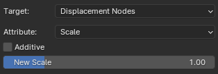{ align=left .img-box }
    Targets the Displacement Node inside the material and you can adjust the following attributes:

    - **Scale**: Specify the new scale to be applied.
    - **Space**: Space of the input height, can be set either to 'Object' or 'World'.

    The scale option has the **Additive** function:

    - **Additive**: When enabled, this option allows you to adjust the current value of by adding or subtracting your chosen value instead of replacing it. For example, if the 'Emission Strength' of a node is set to 1.0 and you enter a value of 5 with 'Additive' enabled, the new value will be 6. If you enter a value of -2, the new value will be -1.

=== "Normal Map Nodes"
    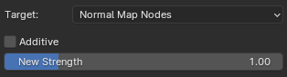{ align=left .img-box }
    Targets all Normal Map Nodes inside the material and allows you to set a new Strength value to be applied.

    

    - **Additive**: When enabled, this option allows you to adjust the current value of by adding or subtracting your chosen value instead of replacing it. For example, if the 'Emission Strength' of a node is set to 1.0 and you enter a value of 5 with 'Additive' enabled, the new value will be 6. If you enter a value of -2, the new value will be -1.

=== "Bump Nodes"
    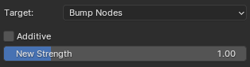{ align=left .img-box }
    Targets all Bump Nodes inside the material and allows you to set a new Strength value to be applied.

    

    - **Additive**: When enabled, this option allows you to adjust the current value of by adding or subtracting your chosen value instead of replacing it. For example, if the 'Emission Strength' of a node is set to 1.0 and you enter a value of 5 with 'Additive' enabled, the new value will be 6. If you enter a value of -2, the new value will be -1.

=== "Seed Sockets"
    { align=left .img-box }
    Targets all sockets containing the word 'seed' inside the material and populates them with random numbers. You can specify the range for the randomly generated values by adjusting the A & B.

---

### Change Material Settings

> Location: 3D Viewport ▸ BatchGenie N-Panel ▸ Utilities

This utility enables you to batch modify material settings across materials.

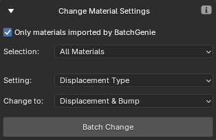{ align=left .img-box }

<h5>Settings</h5>

- **Only materials imported by BatchGenie**:  When enabled, this option ensures that the batch operation only affect materials imported by BatchGenie. Disabling it applies changes to all materials in your file, regardless of their origin.
- **Selection**: Allows you to specify which materials to include in the batch run. Options listed below:
    - **All Materials**
    - **Materials on Selected Objects**
- **Setting**:
    - **Displacement Type**
    - **Eevee Blend Mode**
    - **Eevee Shadow Mode**
    - **Eevee Raytrace Refraction**
    - **Eevee Subsurface Translucency**
    - **Viewport Display Color**: Set the 'Viewport Display Color' of the material to match the 'Base Color' attribute of the main shader.

---

### Replace Shader Nodes

> Location: 3D Viewport ▸ BatchGenie N-Panel ▸ Utilities

This utility lets you replace existing 'Shader Editor' nodes with custom Node-Groups. It targets the main shader connected to the 'Material Output' within the material

*This utility is also available in the "Shader Editor" for processing individual nodes rather than in batch. See [this section](#replace-node) for instructions.*

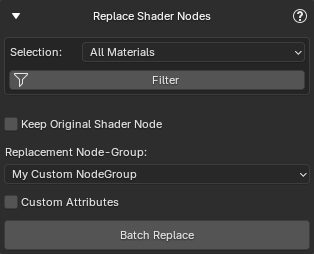{ .img-box align=left }

<h5>Settings</h5>

- **Only materials imported by BatchGenie**:  When enabled, this option ensures that the batch operation only affect materials imported by BatchGenie. Disabling it applies changes to all materials in your file, regardless of their origin.
- **Selection**: Allows you to specify which materials to include in the batch run. Options listed below:
    - **All Materials**
    - **Materials on Selected Objects**

- **Keep Original Shader Node**: Check this option if you want to retain the original node for manual inspection of the connections afterward. The original node will be moved to the side of the replaced node.
- **Replacement Node-Group**: Select the custom Node-Group to replace the shader from a dropdown menu displaying all Node-Groups in the current blend file.
- **Custom Attributes**: Set one or multiple socket attributes such as color or values on the new node. See [this section](importing_textures.md/#custom-attributes) in the documentation for detailed instructions.

---

### Find Unconnected Nodes

> Location: 3D Viewport ▸ BatchGenie N-Panel ▸ Utilities

This utility helps you locate materials with unconnected nodes in your file, such as Image Texture nodes. It generates reports on its findings, which can be viewed via  `Window > Toggle System Console`.

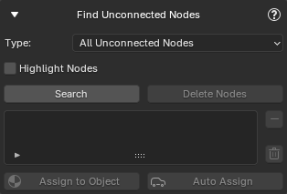{ .img-box align=left }

<h5>Settings</h5>

- **Type**:
    - **All Unconnected Nodes**
    - **Image Texture Nodes**
    - **BatchGenie Imported Textures**: Materials imported by BatchGenie that contain textures which could not be connected. See more [details here](importing_textures.md/#faq) about these nodes.
- **Highlight Nodes**: Changes the color of the found nodes to red, making them easier to spot visually.

<h5>Instructions</h5>

!!! abstract inline end "Example"
    { .img-box .on-glb }

After clicking `Search`, the interface will display a list of all found materials with unconnected nodes. There are three main approaches to handle the issues: **Automatic**, **Manual**, and **Hybrid**.

`Automatic Approach`

:   Use the `Delete Nodes` button to automatically remove all unconnected nodes from materials in the list. You can remove materials from the list if you wish to exclude them from the batch change before clicking the button. No further actions are required.

`Manual Approach`

:   1. Use either the `Assign to Object` button or the `Auto Assign` toggle to assign materials to the selected object:
        - `Assign to Object`: Click to manually assign the selected material.
        - `Auto Assign`: Automatically assigns materials as you select them from the list.
    - Access the material in the 'Shader Editor' to inspect and address issues by reconnecting or removing nodes as needed.
    - Use the `Remove from List` button (:material-minus: icon) to remove materials after resolving issues.
    - Once all materials are addressed and removed, perform a new search to confirm all issues are fixed.

`Hybrid Approach`

:   Mix manual inspection with the automatic process:

    1. Use `Assign to Object` or `Auto Assign` to inspect materials.
    - Verify that unconnected nodes can be safely removed. If not, remove the material from the list to prevent unintended deletions.
    - Use the `Delete Nodes` button to remove nodes from any materials still in the list.

    The Hybrid approach allows you to ensure that the automatic deletion does not remove important nodes.

!!! info2 "Tips"
    - The `Clear List` button (:fontawesome-regular-trash-can: icon) clears all materials from the list, allowing you to start fresh.
    - Use the `Highlight Nodes` checkbox to easily spot the found nodes.
    - Regularly refresh the search to ensure all issues have been captured and addressed.
    - If you need further details about the findings check out the report via `Window > Toggle System Console`

        ??? abstract end "Example Console Report"
            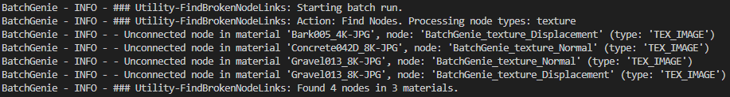{ .img-box }

---

### Find Zero Strength Nodes

> Location: 3D Viewport ▸ BatchGenie N-Panel ▸ Utilities

This feature searches for nodes with critical values set to zero, which may negatively affect the appearance of your materials. You can select specific node types to check: For **Normal Map** and **Bump** nodes, it checks if 'Strength' is zero; for **Displacement** nodes, it verifies if 'Scale' is zero. This helps ensure that your materials function as intended.

*This utility is also available in the "Shader Editor" for processing individual materials rather than in batch. See [this section](#find-zero-strength-nodes-shader-editor) for instructions.*

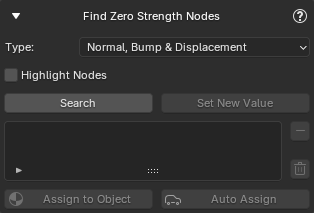{ .img-box align=left }

<h5>Settings</h5>

- **Type**:
    - **Normal, Bump & Displacement**
    - **Normal Map**
    - **Displacement**
- **Highlight Nodes**: Changes the color of the found nodes to red, making them easier to spot visually.

<h5>Instructions</h5>

!!! abstract inline end "Example"
    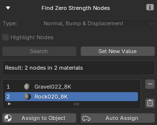{ .img-box .on-glb }

After clicking `Search`, the interface will display a list of all found materials with *Zero Strength* nodes. There are two main approaches to handle the issues: **Automatic** and **Manual**.

`Automatic Approach`

:   Use the `Set New Value` button to batch adjust the values of the nodes in the materials listed. A popup will appear where you can enter the new value. You can also remove materials from the list if you wish to exclude them from the batch change before clicking the button. No further actions are required.

`Manual Approach`

:   1. Use either the `Assign to Object` button or the `Auto Assign` toggle to assign materials to the selected object:
        - `Assign to Object`: Click to manually assign the selected material.
        - `Auto Assign`: Automatically assigns materials as you select them from the list.
    - Access the material in the 'Shader Editor' to inspect and address issues by adjusting the found nodes.
    - Use the `Remove from List` button (:material-minus: icon) to remove materials after resolving issues.
    - Once all materials are addressed and removed, perform a new search to confirm all issues are fixed.

!!! info2 "Tips"
    - The `Clear List` button (:fontawesome-regular-trash-can: icon) clears all materials from the list, allowing you to start fresh.
    - Use the `Highlight Nodes` checkbox to easily spot the found nodes.

---

### Color Space Validator

> Location: 3D Viewport ▸ BatchGenie N-Panel ▸ Utilities

This utility verifies that the image textures within materials in your file are using the correct color space settings, generates reports on its findings, and provides an option to automatically fix any issues.

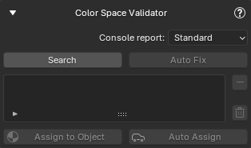{ .img-box align=left }

<h5>Settings</h5>

- **Console report**:
    - **Standard**: Report only includes the textures that have wrong color spaces.
    - **Detailed**: Includes all color space details of all textures.

??? abstract end "Example Console Report"
    To view the report, go to `Window > Toggle System Console`.

    Standard:

    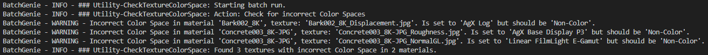{ .img-box .on-glb data-description="Example of standard console report for incorrect color spaces"}

    Detailed:

    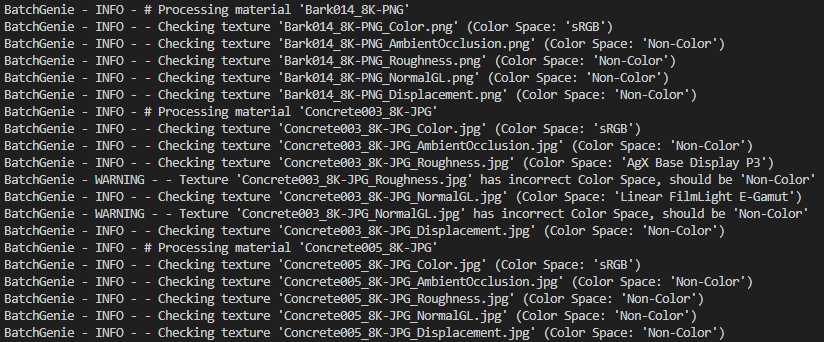{ .img-box .on-glb data-description="Example of detailed console report for incorrect color spaces"}

<h5>Instructions</h5>

!!! abstract inline end "Examples"
    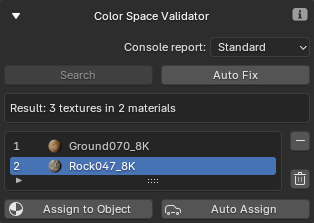{ .img-box .on-glb }

After clicking `Search`, the interface will display a list of all materials with textures that have incorrect color spaces. There are two main approaches to handle the issues: **Automatic** and **Manual**.

`Automatic Approach`

:   Use the `Auto Fix` button to automatically set the correct Color Spaces for texture nodes in the materials listed. You can remove materials from the list if you wish to exclude them from the batch change before clicking the button. No further actions are required.

!!! abstract inline end ""
    This frame is created inside the materials to help you find the relevant textures:
    { .img-box .on-glb }

    *These frames are automatically removed when running `Auto Fix` and can also be removed with the [Clean File](#clean-file) utility.*

`Manual Approach`

:   1. Use either the `Assign to Object` button or the `Auto Assign` toggle to assign materials to the selected object:
        - `Assign to Object`: Click to manually assign the selected material.
        - `Auto Assign`: Automatically assigns materials as you select them from the list.
    - Access the material in the 'Shader Editor' to inspect and address issues by adjusting the found nodes. Look for the node-frame titled '**Incorrect Color Spaces**' that BatchGenie automatically creates, which contains links to all relevant textures.
    - Use the `Remove from List` button (:material-minus: icon) to remove materials after resolving issues.
    - Once all materials are addressed and removed, perform a new search to confirm all issues are fixed.

!!! info2 "Tips"
    - The `Clear List` button (:fontawesome-regular-trash-can: icon) clears all materials from the list, allowing you to start fresh.

---

### Batch Rename

> Location: 3D Viewport ▸ BatchGenie N-Panel ▸ Utilities

While not an all-encompassing renaming tool, this function provides targeted assistance for a few specific use cases. It includes options for aligning mesh names with object names and syncing image names with their file names, making it particularly useful when dealing imported Assets that have inconsistent naming conventions.

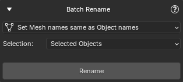{ .img-box align=left }

<h5>Options</h5>
- **Set Mesh names same as Object names**
- **Set Image names same as the Image File names**

??? abstract "Examples"
    **Set Mesh names same as Object names**:

    { .img-box  }

    **Set Image names same as the Image File names**:

    **Use Case:** You imported external models, and all texture names are generic like 'color map', 'roughness map', and 'normal map', making it difficult to track them. This feature solves the issue by renaming image names in Blender to match the actual file names. For example, instead of 'color map', it could be 'Bark_2K_BaseColor'.

    { .img-box  }

---

### Reload Images

> Location: 3D Viewport ▸ BatchGenie N-Panel ▸ Utilities

If you have edited any of your textures externally and the changes are not visible in Blender, use this utility to reload all images in your your file.

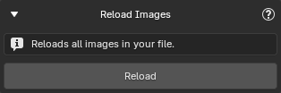{ .img-box  }

---

### Clean File

> Location: 3D Viewport ▸ BatchGenie N-Panel ▸ Utilities

Helps delete any temporary files that might be left behind by BatchGenie. There are two scenarios when you might want to use this utility:

1. **Blender Crashes**: If Blender crashes during import or other batch processes, it can leave behind temporary data (e.g., temp materials, scenes, objects depending on the operation).

2. **Removing Extra Info Nodes**: If you want to remove any extra info nodes created inside your materials by BatchGenie. See the 'Info' box below for details.

<!-- It's useful for removing extra nodes created inside your materials by BatchGenie or clearing temporary data (e.g., temp materials, scenes, objects) if Blender crashes during import or other batch processes. -->

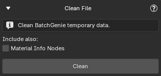{ .img-box align=left }

<h5>Settings</h5>

- **Material Info Nodes**: Checking this option will remove extra nodes that BatchGenie has created inside materials, such as frames and node reroutes that include notes and other useful information. This will not affect the appearance of the materials.

    !!! info2 "Extra Info Nodes"
        Examples of these nodes include:

        - '**Unable to connect**' nodes created during imports when there are issues connecting textures. [See details here](importing_textures.md/#faq).

        - '**Incorrect Color Space**' nodes created by the 'Color Space Validator' utility. [See details here](#color-space-validator).

<!--
??? info2 "BatchGenie Info Nodes"
    BatchGenie Nodes refers to nodes generated by BatchGenie during various batch processes. These nodes often appear as node frames or reroutes and include notes and other useful information.

    For instance, when using the '**Batch Import Textures**' function, BatchGenie creates a 'Unable to connect' nodes when there are issues connecting textures as seen below.

    !!! abstract "Example of unconnected nodes after import"
        In this example BatchGenie has not been able to connect the 'Base Color' & 'Metallic' textures.
        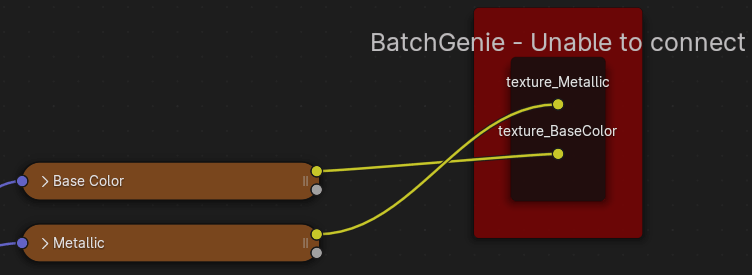{ .img-box } -->

---

### Asset Tags

> Location: Asset Browser ▸ BatchGenie Menu

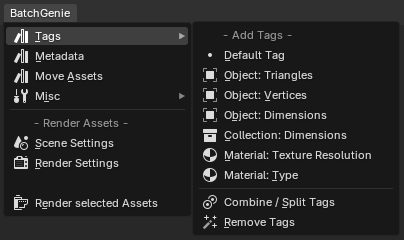{ .img-box align=right }

Add or remove tags from your Assets. Select any number of Assets of any type, choose the desired tags to add, and BatchGenie will assign them to the appropriate Assets. These can be either regular tags or Smart Tags that apply the property of your choice to the Asset.

#### • Add Tags {#Asset-tags-add}

In addition to default tags, you can apply the following Smart Tags:

=== "Object Triangles"
    { .img-box align=left }

    Tags Object Assets with their triangle count, offering customizable formatting and rounding options to suit your needs. Examples illustrate the tag's appearance based on your selections before applying them.

=== "Object Vertices"
    { .img-box align=left }

    Tags Object Assets with their vertex count, offering customizable formatting and rounding options to suit your needs. Examples illustrate the tag's appearance based on your selections before applying them.

=== "Object / Collection Dimensions"
    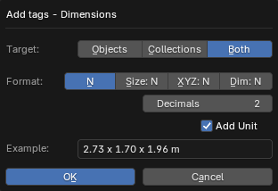{ .img-box align=left }

    Adds Tags displaying the size or dimensions of objects and collections. You can customize the format and adjust options such as decimal precision and unit display. The interface provides an example to preview how the tags will appear based on your selected settings.

=== "Material Texture Resolution"
    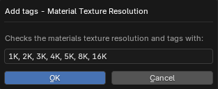{ .img-box align=left }

    Tags material Assets with the texture resolution, like 2K, 4K, or 8K, by identifying the albedo texture within the material and checking its resolution.

#### • Combine / Split Tags {#Asset-tags-combine-split}

{ .img-box align=left }

Combine or split existing tags on Assets. It merges single-word tags into a single line, separated by commas (e.g., "tag1, tag2, tag3"), only if they don't contain spaces.

The split function reverses this, separating combined tags that follow the exact "tag1, tag2, tag3" format. Tags with spaces, like "Long tag with spaces," are unaffected by either function.

#### • Remove Tags {#Asset-tags-remove}

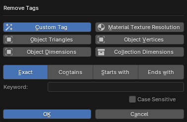{ .img-box align=left }

This feature allows you to efficiently remove tags from selected Assets. You can search using a keyword with options for "exact," "contains," "starts with," or "ends with," along with a "case sensitive" option to precisely target specific tags. Additionally, you can target specific Smart Tags applied by BatchGenie. Simply select the tag type and click "OK" to proceed with the removal.

---

### Asset Metadata

> Location: Asset Browser ▸ BatchGenie Menu

Batch add metadata for your Assets: Description, License, Copyright, and Author. You can select and edit one or multiple attributes simultaneously.

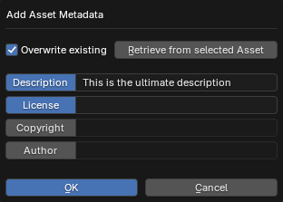{ .img-box align=left }

---

## Single Operation Utilities

### Replace Node

> Location: Shader Editor ▸ BatchGenie N-Panel

This utility offers similar functionality to the [Replace Shader Nodes](#replace-shader-nodes) utility but is designed for processing individual nodes rather than batch adjustments. It also allows you to replace any type of node, not just the main shader node as in the main utility.

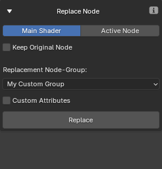{ .img-box align=left }

<h5>Settings</h5>

- **Target**:
    - **Main Shader**: Targets the main shader connected to the 'Material Output' inside the material.
    - **Active Node**: Select a node manually.
- **Keep Original Node**: Check this option if you want to retain the original node for manual inspection of the connections afterward. The original node will be moved to the side of the replaced node.
- **Replacement Node-Group**: Select the custom Node-Group to replace the shader from a dropdown menu displaying all Node-Groups in the current blend file.
- **Custom Attributes**: Set one or multiple socket attributes such as color or values on the new node. See [this section](importing_textures.md/#custom-attributes) in the documentation for detailed instructions.

---

### Find Zero Strength Nodes {#find-zero-strength-nodes-shader-editor}

> Location: Shader Editor ▸ BatchGenie N-Panel

This utility offers the same functionality as the [Find Zero Strength Nodes](#find-zero-strength-nodes) utility but is designed for processing individual materials rather than batch adjustments.

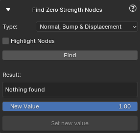{ .img-box align=left }

<h5>Settings</h5>

- **Type**:
    - **Normal, Bump & Displacement**
    - **Normal Map**
    - **Displacement**

- **Highlight Nodes**: Changes the color of the found nodes to red, making them easier to spot visually.

